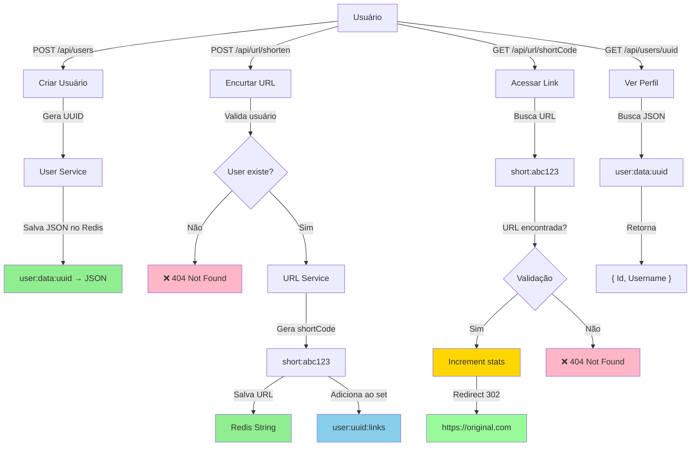
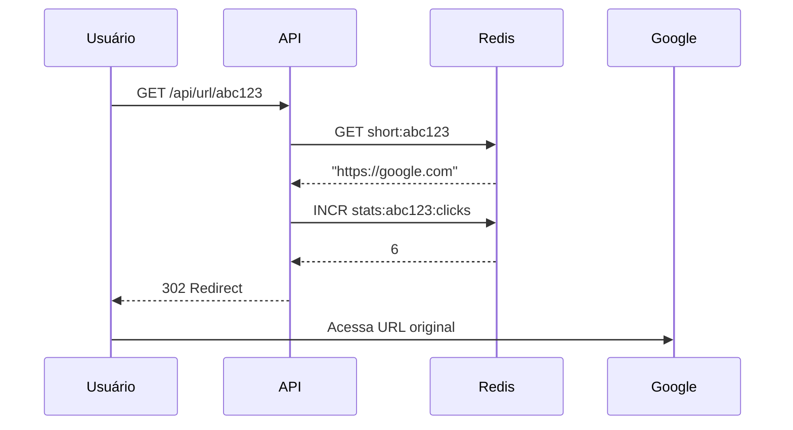

# 🔗 URL Shortener - Fluxos e Casos de Uso

## 📊 Diagrama Geral de Fluxos



---

## 🎯 Casos de Uso

### 1️⃣ Criar Usuário

**Endpoint:** `POST /api/users`

**Request:**
```json
{
  "username": "joão"
}
```

**Response (201 Created):**
```json
{
  "id": "da2be45b-1251-4567-9b64-3c15878afd07",
  "username": "joão"
}
```

**O que acontece:**
- ✅ Backend gera um `UUID` automaticamente
- ✅ Armazena no Redis como **JSON String**:
  ```
  user:data:da2be45b-1251-4567-9b64-3c15878afd07 → 
  {"Id":"da2be45b-1251-4567-9b64-3c15878afd07","Username":"joão"}
  ```
- ✅ Retorna status `201 Created` com o objeto criado

**Estrutura Redis:**
```
Tipo: STRING (JSON)
Chave: user:data:{userId}
Valor: {"Id":"...", "Username":"..."}
```

---

### 2️⃣ Encurtar URL

**Endpoint:** `POST /api/url/shorten`

**Request:**
```json
{
  "userId": "da2be45b-1251-4567-9b64-3c15878afd07",
  "originalUrl": "https://www.google.com/search?q=test"
}
```

**Response (200 OK):**
```json
{
  "shortCode": "abc123"
}
```

**Fluxo:**
1. ✅ Valida se o usuário existe
2. ✅ Gera um `shortCode` aleatório (6 caracteres)
3. ✅ Armazena a URL original no Redis (com TTL de 90 dias)
4. ✅ Adiciona o `shortCode` ao set do usuário

**Estruturas criadas no Redis:**

**String (URL Original):**
```
Tipo: STRING
Chave: short:abc123
Valor: "https://www.google.com/search?q=test"
TTL: 90 dias
```

**Set (Links do usuário):**
```
Tipo: SET
Chave: user:da2be45b-1251-4567-9b64-3c15878afd07:links
Valores: {"abc123", "def456", "ghi789"}
```

**Erros possíveis:**
- ❌ `404 Not Found` - Usuário não existe
- ❌ `400 Bad Request` - URL vazia

---

### 3️⃣ Acessar Link Encurtado

**Endpoint:** `GET /api/url/{shortCode}`

**Exemplo:** `GET /api/url/abc123`

**Resposta (302 Found):**
```
Location: https://www.google.com/search?q=test
```

**Fluxo:**
1. ✅ Busca a URL no Redis pela chave `short:shortCode`
2. ✅ Se encontrar: incrementa o contador de clicks
3. ✅ Redireciona (302) para a URL original
4. ✅ Se não encontrar: retorna `404 Not Found`

**O que muda no Redis:**
```
Antes:
stats:abc123:clicks → 5

Depois:
stats:abc123:clicks → 6
```

**Sequência:**


---

### 4️⃣ Ver Perfil do Usuário

**Endpoint:** `GET /api/users/{userId}`

**Exemplo:** `GET /api/users/da2be45b-1251-4567-9b64-3c15878afd07`

**Response (200 OK):**
```json
{
  "id": "da2be45b-1251-4567-9b64-3c15878afd07",
  "username": "joão"
}
```

**Fluxo:**
1. ✅ Busca a chave `user:data:{userId}` no Redis
2. ✅ Se encontrar: retorna os dados deserializados
3. ✅ Se não encontrar: retorna `404 Not Found`

---

### 5️⃣ Listar Todas as URLs de um Usuário

**Cenário:** Você quer listar todas as URLs que um usuário criou

**Fluxo em 2 etapas:**

```csharp
// 1º: Peg tutti os shortCodes
var codes = await _repository.GetUserLinkCodesAsync(userId);
// Retorna: ["abc123", "def456", "ghi789"]

// 2º: Busca as URLs originais
var urls = await _repository.GetUrlsByCodesAsync(codes);
// Retorna: ["https://google.com", "https://github.com", "https://microsoft.com"]
```

**Operações Redis:**
```
1. SMEMBERS user:uuid:links
   → ["abc123", "def456", "ghi789"]

2. MGET short:abc123 short:def456 short:ghi789
   → ["https://google.com", "https://github.com", "https://microsoft.com"]
```

---

## 🗂️ Estrutura Completa do Redis

```
┌────────────────────────────────────────────────┐
│           REDIS DATABASE STRUCTURE             │
├────────────────────────────────────────────────┤
│                                                │
│  USERS:                                        │
│  ├─ user:data:uuid1 (STRING - JSON)          │
│  │  └─ {"Id":"uuid1", "Username":"joão"}     │
│  ├─ user:data:uuid2 (STRING - JSON)          │
│  │  └─ {"Id":"uuid2", "Username":"maria"}    │
│  │                                            │
│  LINKS (Short URLs):                          │
│  ├─ short:abc123 (STRING)                    │
│  │  └─ "https://google.com"                  │
│  ├─ short:def456 (STRING)                    │
│  │  └─ "https://github.com"                  │
│  │                                            │
│  LINK COLLECTIONS (User's Links):            │
│  ├─ user:uuid1:links (SET)                   │
│  │  └─ {"abc123", "def456"}                  │
│  ├─ user:uuid2:links (SET)                   │
│  │  └─ {"ghi789"}                            │
│  │                                            │
│  ANALYTICS (Click Counts):                    │
│  ├─ stats:abc123:clicks (STRING)             │
│  │  └─ 42                                     │
│  ├─ stats:def456:clicks (STRING)             │
│  │  └─ 15                                     │
│  │                                            │
└────────────────────────────────────────────────┘
```

---

## 🔄 Ciclo de Vida de uma URL

```
1. CRIAÇÃO
   User cria conta
   ↓
   User encurta URL → shortCode criado
   ↓
   Redis salva: short:shortCode = URL original
   Redis salva: user:uuid:links ← adiciona shortCode

2. USO
   Alguém acessa /api/url/shortCode
   ↓
   Redis incrementa: stats:shortCode:clicks += 1
   ↓
   Usuário é redirecionado para URL original

3. EXPIRAÇÃO (90 dias)
   Redis automaticamente remove a chave
   ↓
   Link fica inacessível (404 Not Found)
```

---

## 📈 Tipos de Dados Redis Utilizados

| Tipo | Chave | Exemplo | Uso |
|------|-------|---------|-----|
| **STRING** | `user:data:{uuid}` | JSON do usuário | Armazenar dados do usuário |
| **STRING** | `short:{code}` | URL original | Armazenar URL encurtada |
| **STRING** | `stats:{code}:clicks` | Número | Contar clicks |
| **SET** | `user:{uuid}:links` | Coleção de codes | Lista de links do user |

---

## ✅ Validações e Erros

| Operação | Validação | Erro | Status |
|----------|-----------|------|--------|
| Criar User | Username não vazio | Username required | `400` |
| Encurtar URL | User existe | User not found | `404` |
| Encurtar URL | URL não vazia | URL required | `400` |
| Acessar Link | Link existe | Short URL not found | `404` |
| Ver User | User existe | User not found | `404` |

---

## 🚀 Possíveis Melhorias Futuras

1. **Autenticação/Autorização** - Adicionar JWT tokens
2. **Apenas links próprios** - Usuário só vê seus links
3. **Analytics Dashboard** - Gráficos de clicks por link/período
4. **Custom short codes** - Permitir usuário escolher o código
5. **Compartilhamento** - Gerar links com permissão de leitura
6. **Rate limiting** - Limitar requisições por usuário
7. **Cache** - Adicionar cache em memória para links populares
8. **Banco de dados** - Migrar Analytics para PostgreSQL (persistência)
